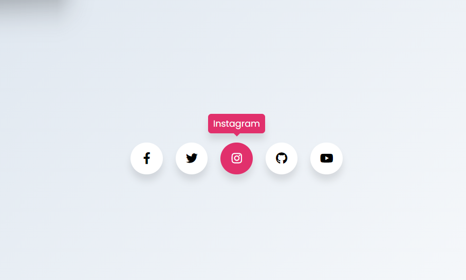

# Pop-up-de-midia-sociais

> Desafio de criar uma Pagina de login simples e moderna

### Ajustes e melhorias

O projeto ainda está em desenvolvimento e as próximas atualizações serão voltadas nas seguintes tarefas:

- [x] Tarefa 1      Executar o Desafio e concluir 5 pop ups de redes sociais

### Conhecimento usado no desafio

-HTML usado para semanticamente para melhor acessibilidade
 
-CSS exercitado com flexbox, position absolute, reset basico de css para melhor aproveitamento do CSS, uso de transition para coisas simples e outros comandos css para personalizacão da pagina

## 📫 Quer executar o Desafio e aprender?
Aqui estão os links para executar o projeto

<a href="https://youtu.be/X86OxINWnVk">Video ensinando a fazer<a/>
 
<a href="https://www.futurecodersweb.com/2021/05/social-media-icons-with-tooltip-on.html">Post no blog sobre o desafio<a/>
 
<a href="https://fordunn.github.io/Pop-up-de-midia-sociais/">Link do site hospedado<a/>
